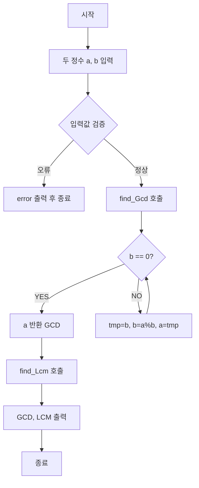

#GCD & LCM 계산 프로그램

##개요
두 정수를 입력받아 최대공약수(GCD)와 최소공배수(LCM)를 계산하여 출력하는 프로그램이다.
---------
##알고리즘 설명

###GCD(최대공약수)-유클리드 호제법

두 정수 a,b에 대해 a를 b로 나눈 나머지를 반복적으로 구하여 나머지가 0이 될 때의 나누는 수가 GCD이다.

**Pesudo 코드**
```
my_math find_Gcd(my_math a, my_math b) {
	while ( b!= 0) {
		int tmp = b;
		b = a % b;
		a = tmp;
	}
	return a;
}
```
**예시(18, 24)**
```
1단계 a=18, b=24 -> tmp=24,b=18%24=18, a=24
2단계 a=24, b=18 -> tmp=18 b=24%18=6, a=18
3단계 a=18, b=6 -> tmp=18, b=18%6=0 a=6
4단계 b=0 -> return 6

GCD=6
```
----
###LCM(최소 공배수)

GCD를 이용하여 LCM을 계산한다
두 수의 곱을 GCD로 나누면 LCM이 된다
이때 오버플로우 방지를 위해 a를 먼저 GCD로 나눈 후b를 곱한다
**Pesudo 코드**
```
my_math find_Lcm(my_math a, my_math b) {
	
		int gcd = find_Gcd(a, b);
		int Lcm = a / gcd * b;
		return Lcm;
	
}
```
**예시(18, 24)**
```
find_Lcm(18, 24)
->gcd=find_Gcd(18,24)=6
->Lcm=(18/6)*24=3*24=72
return Lcm(72)
```
----
##실행 흐름

---
##함수 목록

###최대 공약수 계산
```c
my_math find_Gcd(my_math a, my_math b)
```
**입력**: 정수 두 개(a,b)
**출력**: 두 정수의 최대 공약수
**설명**: 유클리드 호제법을 사용하여 GCD를 계산
---
###최소공배수 계산
```c
my_math find_Lcm(my_math a, my_math b)
```
**입력**: 정수 두 개(a,b)
**출력**:두 정수의 최소공배수
**설명**'(a/gcd(a,b))*b'공식을 사용하여 Lcm을 계산 a,b를 곱한 후 나누면 a,b를 곱했을때 오버플로우가 일어날수도 있기에 a를 먼저 나누어 오버플로우를 방지
---
##입출력 예시


---
##파일구조
```
my_math.h #함수 선언
my_math.c#GCD, LCM함수 구현
main.c   #main 함수 (입력 처리 및 출력)
